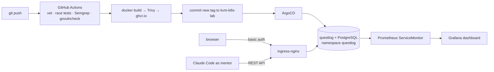

# questlog

An RPG-style tracker for my preparation for the CKA exam, DevOps interviews and English. I earn XP for daily quests, beat weekly "bosses" (real tasks in my homelab) and practise interview questions. Claude acts as the mentor through the API.

It is also a small production-style service. It runs in my [kvm-k8s-lab](https://github.com/sadqwes/kvm-k8s-lab) with the same GitOps flow as my other apps.



## What's inside

| Part | Details |
|---|---|
| Backend | Go 1.26, standard `net/http` routing, `pgx` for PostgreSQL, embedded SQL migrations |
| Frontend | Plain HTML/CSS/JS embedded into the binary, strict Content-Security-Policy, no build step |
| Plan | `internal/plan/october.json` — the quests are data. I change them in Git, not in code |
| Game rules | `internal/game` — XP, levels, achievements, boss HP. Pure functions with unit tests. XP never goes down |
| Observability | JSON logs (for Loki), Prometheus metrics: `questlog_hero_xp`, `questlog_skill_xp{skill}`, `questlog_boss_hp{week}`, `questlog_arena_topic_score{topic}`, HTTP rate and latency |
| Image | Multi-stage build → `distroless/static:nonroot`, ~25 MB, no shell |
| Security | Semgrep (SAST), govulncheck (SCA), Trivy (image). All blocking in CI. Non-root, read-only root filesystem, all capabilities dropped |
| Deploy | ArgoCD Applications, Bitnami PostgreSQL on Longhorn, SealedSecrets, ingress basic auth, ServiceMonitor |

## Run locally

Only Docker is needed:

```bash
make up        # http://localhost:8080
make check     # everything CI checks
make reset     # stop and wipe the local database
```

## Deploy to the lab

The manifests in `deploy/kvm-k8s-lab/` mirror the lab repo layout.

1. Copy `deploy/kvm-k8s-lab/gitops/*` into the lab repo.
2. Add `questlog.json` to `gitops/platform/monitoring/dashboards/kustomization.yaml`:
   ```yaml
     - name: dash-questlog
       files: [questlog.json]
       options:
         labels:
           grafana_dashboard: "1"
   ```
3. Create the sealed secrets (plain values never touch Git):
   ```bash
   kubectl -n questlog create secret generic questlog-postgres-creds \
     --from-literal=password="$(openssl rand -hex 16)" \
     --from-literal=postgres-password="$(openssl rand -hex 16)" \
     --dry-run=client -o yaml | kubeseal --format yaml \
     > gitops/platform/questlog/questlog-postgres-creds-sealed.yaml

   htpasswd -nB "$USER" > /tmp/auth   # login = your macOS user, asks for a password twice
   kubectl -n questlog create secret generic questlog-basic-auth --from-file=auth=/tmp/auth \
     --dry-run=client -o yaml | kubeseal --format yaml \
     > gitops/platform/questlog/questlog-basic-auth-sealed.yaml
   rm /tmp/auth
   ```
4. Add `questlog.local` to `/etc/hosts` with the ingress IP from MetalLB.
5. In the `questlog` GitHub repo add the `KVM_LAB_PAT` secret (the same token knowledge-graph-api uses). After the first push, make the `questlog` package on ghcr.io public, or add an imagePullSecret.

## API

| Method | Path | Body |
|---|---|---|
| GET | `/api/state` | — plan, calendar, progress and computed stats |
| GET | `/api/days/{date}` | — quests, marks and guides of one day |
| PUT | `/api/marks/{date}/{skill}` | `{"level": 0\|1\|2}` |
| PATCH | `/api/days/{date}` | `{"rest": bool, "note": "..."}` |
| PUT | `/api/weeks/{week}/items/{t0\|l0…}` | `{"done": bool}` |
| PUT | `/api/weeks/{week}/review` | `{"good","hard","change","story","book","weight"}` |
| PUT | `/api/chapters/{n}` | `{"read": bool}` |
| PUT / DELETE | `/api/guides/{date}/{skill}` | `{"content": "markdown"}` |
| GET | `/api/arena?status=new\|answered\|reviewed` | — |
| POST | `/api/arena` | `{"kind":"q\|mock","lang":"ru\|en","topic","question",…}` |
| PATCH | `/api/arena/{id}` | `{"answer"}` or `{"feedback","score"}` |
| GET | `/healthz`, `/readyz`, `/metrics` | — |

## Ideas for later

- TLS for `questlog.local` through cert-manager (the week 2 boss in the plan).
- The plan as a ConfigMap (`PLAN_FILE`) generated by Kustomize, so a plan change doesn't need a new image.
- A pg_dump CronJob to MinIO, like the other databases in the lab.
- A Telegram bot with the day's quests in the morning.
